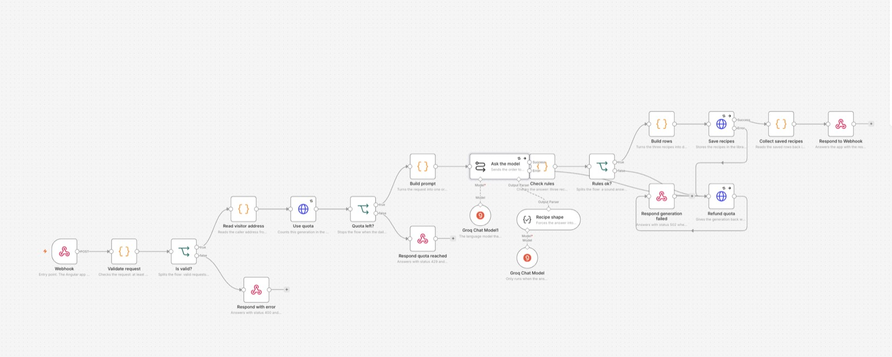
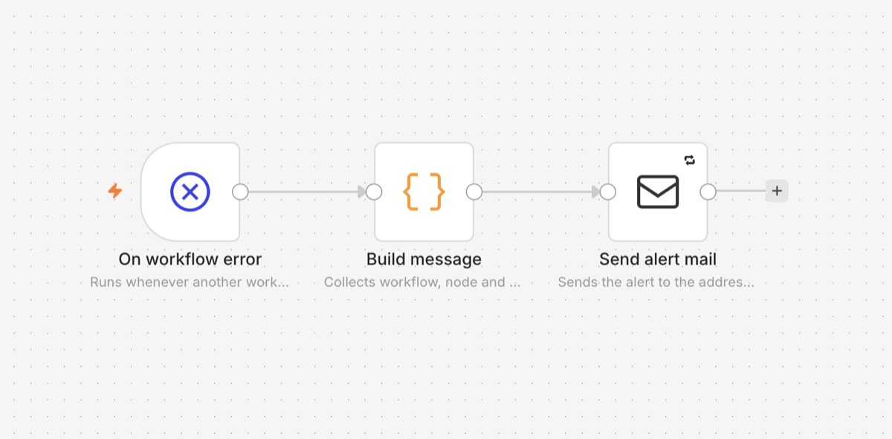

# Code à Cuisine

Recipe generator that turns the ingredients you already have at home into three recipe
ideas. Every generated recipe is stored and stays available in a public library, so
nobody needs an account to browse them.

The interface speaks English and German, the recipes are written in the language that was
chosen when they were generated.

The frontend is an Angular app. The recipes come from an automation workflow in n8n that
validates the request, asks an AI model for three recipes and writes the result to the
database.

**Live: https://cuisine.weskakay.de**. Generating works there, and every recipe stays in
the library, see [The hosted version](#the-hosted-version).


## What it does

1. You list what is in your kitchen, with amount and unit.
2. You say how many portions, how many cooks, how much time, which cooking style and
   which diet.
3. The workflow asks the model for exactly three recipes, checks the answer and stores it.
4. You get three suggestions, each with steps split by cook, waiting times and the
   nutritional values per portion and for the whole dish.
5. Every recipe stays in the library, browsable without an account, and anyone can
   give it a heart.

Three recipes per address and day, twelve per day in total. A failed run gives the
attempt back.

| Library | One recipe |
|---|---|
|  |  |

## Tech stack

- Angular 22, standalone components, signals, reactive forms
- SCSS with design tokens
- n8n for the automation workflow, in Docker locally and on n8n Cloud for the hosted page
- Supabase as the database

## Requirements

- Node.js 24 and npm 11
- Docker Desktop, for running n8n locally
- A Groq API key for the model, free at https://console.groq.com/keys

## Setup on macOS

Clone the repository:

```bash
git clone <repository-url>
```

Change into the folder:

```bash
cd code-a-cuisine
```

Install the dependencies:

```bash
npm ci
```

Start the app:

```bash
npm start
```

## Setup on Windows

Clone the repository:

```powershell
git clone <repository-url>
```

Change into the folder:

```powershell
cd code-a-cuisine
```

Install the dependencies:

```powershell
npm ci
```

Start the app:

```powershell
npm start
```

The app runs on http://localhost:4200.

## Configuration

The app keeps its settings in `src/environments/environment.ts`:

| Value | Meaning |
|---|---|
| `supabaseUrl`, `supabaseKey` | the public database connection, used to read the library |
| `webhookUrl` | where the workflow listens, by default the local n8n |
| `generation` | `false` hides the generator: both step screens point to the library and the submit button stays disabled |

The two Supabase values are meant to be public. The database only answers read requests;
writing is done by the workflow with a key that never leaves n8n. **If n8n runs on another
port or on a server, change `webhookUrl` here.**

The `.env` file is read by Docker only, never by the Angular app.

A production build swaps that file for `src/environments/environment.production.ts`
through `fileReplacements` in `angular.json`, and `angular.json` makes `production` the
default, so a bare `ng build` already picks it.

## The hosted version

https://cuisine.weskakay.de

The page generates recipes. The workflow for it runs on n8n Cloud, because a shared web
space cannot host a program that has to stay awake. Locally the same workflow runs in
Docker, and `src/environments/environment.ts` keeps pointing at `localhost:5678`, so a
local run never eats from the daily limit of the hosted one.

The hosted address lives in `src/environments/environment.production.ts`:

```ts
webhookUrl: 'https://<instance>.app.n8n.cloud/webhook/generate-recipes',
generation: true,
```

Switching the generator off again is the same file: an empty `webhookUrl` and
`generation: false`. The library keeps every recipe either way.

The webhook node lists both origins under *Allowed Origins*, the local one and the hosted
one, so the browser is allowed to call it from either.

Build and upload:

```bash
npm run build
```

Upload everything inside `dist/code-a-cuisine/browser` to the web space. The `.htaccess`
in that folder forces https and answers every unknown path with `index.html`, so a shared
recipe link opens the recipe instead of a 404.

## Running n8n

Copy the environment file. It holds the timezone and the address that receives alerts:

```bash
cp .env.example .env
```

On Windows:

```powershell
copy .env.example .env
```

Start n8n in the background:

```bash
docker compose up -d
```

Stop it again:

```bash
docker compose down
```

The editor runs on http://localhost:5678. Workflows are stored in the Docker volume
`n8n_data` and survive a restart.

## Scripts

Check the code style:

```bash
npm run lint
```

Run the tests:

```bash
npm test
```

Build for production:

```bash
npm run build
```

## Pages

| Route | Content |
|---|---|
| `/` | start page |
| `/generate` | the ingredients you have |
| `/preferences` | portions, cooks, time, cuisine, diet |
| `/results` | the three suggestions |
| `/recipe/:id` | one recipe in full |
| `/cookbook` | the library, filtered by cooking style |
| `/imprint` | legal notice |

## Project structure

```text
src/app/components   screens and reusable parts
src/app/services     data access and shared logic
src/app/interfaces   the types shared with the workflow
src/styles           design tokens and base styles
n8n/workflows        exported automation workflows
```

## How the daily limit finds the visitor

Both limits live in `supabase/schema.sql`, in the function `use_quota`: three recipes per
address and day, twelve per day in total.

The node `Read visitor address` decides whose address that is. Reading the chain in
`x-forwarded-for` from the right only works behind a proxy we own; behind n8n Cloud the
last entry is Cloudflare, the same for everybody, which would lock out every visitor after
three recipes. So the node prefers `cf-connecting-ip`, which Cloudflare overwrites and a
caller therefore cannot fake. Without that header it falls back to the first entry of
`x-forwarded-for` that is a real public address, and to `127.0.0.1` if nothing is left.

Addresses are normalised first, so `[2001:db8::1]:443` and `::ffff:1.2.3.4` do not end up
as a second row for the same visitor. Anything that is not an address falls back to
`127.0.0.1` instead of reaching the database, which expects the `inet` type.

To look at the counters:

```sql
select ip::text, family(ip) as version, day, count
  from public.quota_usage where day = current_date order by count desc;
```

## Data format

The app posts this to the workflow:

```json
{
  "ingredients": [{ "name": "Pasta", "amount": 100, "unit": "g" }],
  "portions": 2,
  "cookingTime": "quick",
  "cuisine": "italian",
  "diet": "vegetarian",
  "helpers": 2,
  "language": "en"
}
```

`unit` is `g`, `ml` or `piece`. `cookingTime` is `quick`, `medium` or `complex`. `cuisine`
is one of german, italian, japanese, indian, gourmet, fusion. `diet` is vegetarian, vegan,
keto or none. Portions run from 1 to 12, helpers from 1 to 3. `language` is `en` or `de`
and decides which language the model writes the recipes in.

The answer holds three saved recipes and what is left of the daily limit:

```json
{
  "recipes": [{ "id": "…", "title": "…", "steps": [], "nutritionPerPortion": {} }],
  "quota": { "remaining": 2, "limit": 3 }
}
```

Errors come back as `{ "error": "one sentence" }` with status 400 for a bad request, 429
when the limit is reached and 502 when the model broke the rules. The types live in
`src/app/interfaces/recipe.interface.ts`.

## The workflows

`Generate recipes` takes the request, counts it against the daily limit, asks the model,
checks the answer against the rules and stores the three recipes. Every branch ends in an
answer: 400 for a bad request, 429 when the limit is used up, 502 when the model broke the
rules, and in that case the generation is given back.



`Error handler` is registered as the error workflow of the first one. It runs whenever a
node fails for real, collects what happened and sends one mail.



## Importing the workflows

The exported workflows live in `n8n/workflows/`.

Start n8n, open it, then use the menu next to the workflow name and pick Import from File.
Import `generate-recipes.json` and `error-handler.json`.

Credentials are not part of the export, so create them once in n8n and select them in the
nodes that need them:

| Credential | Used by |
|---|---|
| Groq API | Groq Chat Model1, Groq Chat Model |
| Supabase API, service role secret | Use quota, Save recipes, Refund quota |
| SMTP account | Send alert mail |

Publish `Error handler`, then open the settings of `Generate recipes` and pick it as the
error workflow. The id stored in the export belongs to another installation and will not
match. Publish `Generate recipes` last.

On n8n Cloud two things differ from a local run: environment variables are blocked, so the
alert address has to be typed into `Send alert mail` instead of reading `$env.ALERT_EMAIL`,
and the model needs room for three recipes at once, which is why both Groq nodes set
*Maximum Number of Tokens* to 16000.

The database part lives in `supabase/schema.sql`. Run it once in the Supabase SQL editor.

## Licence

MIT
