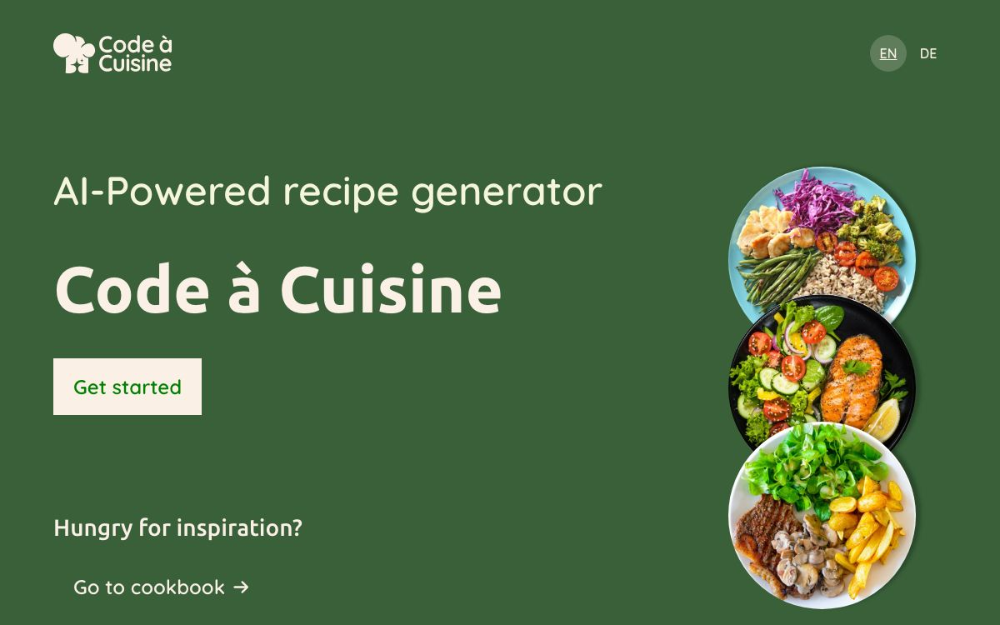
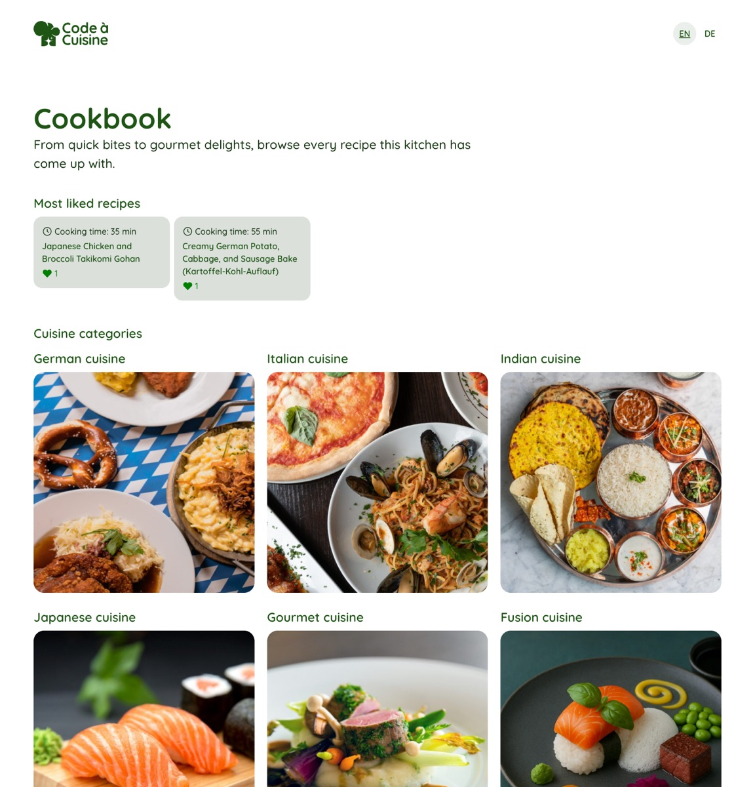
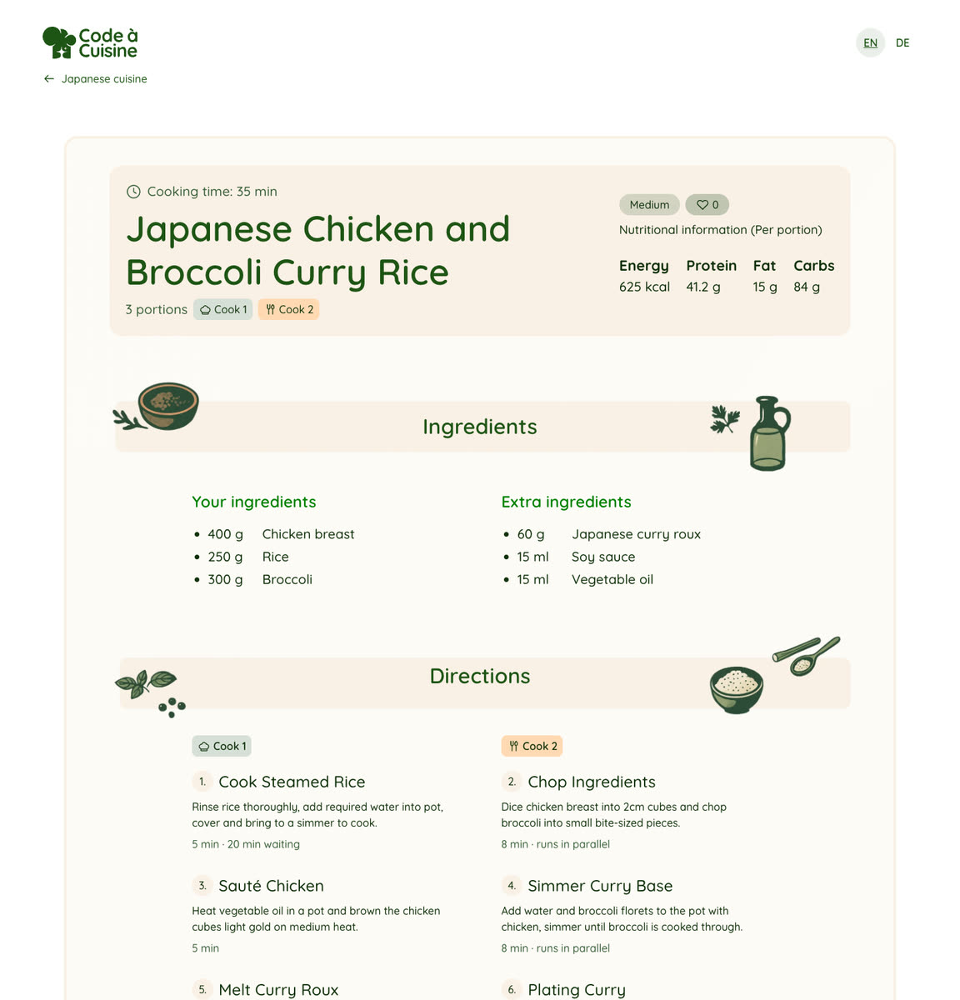

# Code à Cuisine

Recipe generator that turns the ingredients you already have at home into three recipe
ideas. Every generated recipe is stored and stays available in a public library, so
nobody needs an account to browse them.

The interface speaks English and German, the recipes are written in the language that was
chosen when they were generated.

The frontend is an Angular app. The recipes come from an automation workflow in n8n that
validates the request, asks an AI model for three recipes and writes the result to the
database.

**Live: https://cuisine.weskakay.de**. It shows the library with every recipe generated
so far. Writing new ones runs locally, see [The hosted version](#the-hosted-version).



## What it does

1. You list what is in your kitchen, with amount and unit.
2. You say how many portions, how many cooks, how much time, which cooking style and
   which diet.
3. The workflow asks the model for exactly three recipes, checks the answer and stores it.
4. You get three suggestions, each with steps split by cook, waiting times and the
   nutritional values per portion and for the whole dish.
5. Every recipe stays in the library, browsable without an account, and anyone can
   give it a heart.

Three recipes per address and day, twelve per day in total. A failed run gives the
attempt back.

| Library | One recipe |
|---|---|
|  |  |

## Tech stack

- Angular 22, standalone components, signals, reactive forms
- SCSS with design tokens
- n8n for the automation workflow, running in Docker
- Supabase as the database

## Requirements

- Node.js 24 and npm 11
- Docker Desktop

## Setup on macOS

Clone the repository:

```bash
git clone <repository-url>
```

Change into the folder:

```bash
cd code-a-cuisine
```

Install the dependencies:

```bash
npm ci
```

Start the app:

```bash
npm start
```

## Setup on Windows

Clone the repository:

```powershell
git clone <repository-url>
```

Change into the folder:

```powershell
cd code-a-cuisine
```

Install the dependencies:

```powershell
npm ci
```

Start the app:

```powershell
npm start
```

The app runs on http://localhost:4200.

## Configuration

The app keeps its two addresses in `src/environments/environment.ts`:

| Value | Meaning |
|---|---|
| `supabaseUrl`, `supabaseKey` | the public database connection, used to read the library |
| `webhookUrl` | where the workflow listens, by default the local n8n |

Both values are meant to be public. The database only answers read requests; writing is
done by the workflow with a key that never leaves n8n. **If n8n runs on another port or
on a server, change `webhookUrl` here.**

The `.env` file is read by Docker only, never by the Angular app.

A production build swaps that file for `src/environments/environment.production.ts`
through `fileReplacements` in `angular.json`. The hosted version therefore reads the same
database but has no webhook address.

## The hosted version

https://cuisine.weskakay.de

The workflow runs in Docker on a local machine, so the hosted page cannot reach it. It
shows the library with every recipe generated so far; the generator says so on both of
its screens and points to the library instead. Switching it on later means one value:

```ts
// src/environments/environment.production.ts
webhookUrl: 'https://your-n8n-host/webhook/generate-recipes',
generation: true,
```

n8n then needs to allow the origin of the page, and the hosting note further down applies.

Build and upload:

```bash
npm run build
```

Upload everything inside `dist/code-a-cuisine/browser` to the web space. The `.htaccess`
in that folder forces https and answers every unknown path with `index.html`, so a shared
recipe link opens the recipe instead of a 404.

## Running n8n

Copy the environment file. It holds the timezone and the address that receives alerts:

```bash
cp .env.example .env
```

On Windows:

```powershell
copy .env.example .env
```

Start n8n in the background:

```bash
docker compose up -d
```

Stop it again:

```bash
docker compose down
```

The editor runs on http://localhost:5678. Workflows are stored in the Docker volume
`n8n_data` and survive a restart.

## Scripts

Check the code style:

```bash
npm run lint
```

Run the tests:

```bash
npm test
```

Build for production:

```bash
npm run build
```

## Pages

| Route | Content |
|---|---|
| `/` | start page |
| `/generate` | the ingredients you have |
| `/preferences` | portions, cooks, time, cuisine, diet |
| `/results` | the three suggestions |
| `/recipe/:id` | one recipe in full |
| `/cookbook` | the library, filtered by cooking style |
| `/imprint` | legal notice |

## Project structure

```text
src/app/components   screens and reusable parts
src/app/services     data access and shared logic
src/app/interfaces   the types shared with the workflow
src/styles           design tokens and base styles
n8n/workflows        exported automation workflows
```

## Hosting note for the workflow

n8n has to sit behind our own reverse proxy in production, with the proxy appending the
caller address to `x-forwarded-for` and `N8N_PROXY_HOPS` set to the number of proxies.
The daily limit reads the last entry of that header, so a caller cannot fake an address
and ask for more recipes than allowed.

## Data format

The app posts this to the workflow:

```json
{
  "ingredients": [{ "name": "Pasta", "amount": 100, "unit": "g" }],
  "portions": 2,
  "cookingTime": "quick",
  "cuisine": "italian",
  "diet": "vegetarian",
  "helpers": 2,
  "language": "en"
}
```

`unit` is `g`, `ml` or `piece`. `cookingTime` is `quick`, `medium` or `complex`. `cuisine`
is one of german, italian, japanese, indian, gourmet, fusion. `diet` is vegetarian, vegan,
keto or none. Portions run from 1 to 12, helpers from 1 to 3. `language` is `en` or `de`
and decides which language the model writes the recipes in.

The answer holds three saved recipes and what is left of the daily limit:

```json
{
  "recipes": [{ "id": "…", "title": "…", "steps": [], "nutritionPerPortion": {} }],
  "quota": { "remaining": 2, "limit": 3 }
}
```

Errors come back as `{ "error": "one sentence" }` with status 400 for a bad request, 429
when the limit is reached and 502 when the model broke the rules. The types live in
`src/app/interfaces/recipe.interface.ts`.

## Importing the workflows

The exported workflows live in `n8n/workflows/`.

Start n8n, open it, then use the menu next to the workflow name and pick Import from File.
Import `generate-recipes.json` and `error-handler.json`.

Credentials are not part of the export, so create them once in n8n and select them in the
nodes that need them:

| Credential | Used by |
|---|---|
| Google Gemini(PaLM) API | Gemini model |
| Supabase API, service role secret | Use quota, Save recipes |
| SMTP account | Send alert mail |

Publish `Error handler`, then open the settings of `Generate recipes` and pick it as the
error workflow. Publish `Generate recipes` last.

The database part lives in `supabase/schema.sql`. Run it once in the Supabase SQL editor.

## Licence

MIT
